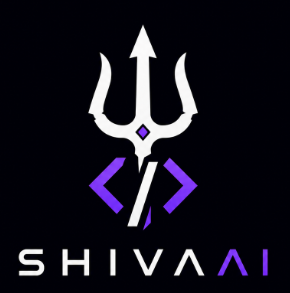

# ShivaAi-Code-Auditor — Cyber Audit Engine

## 🛡️ About the Skill

**ShivaAi-Code-Auditor** is an elite skill designed for code security auditing and strategic intelligence in hostile architectures. Unlike generic scanners, this engine focuses on **offensive-defensive strategy**, complex flow analysis, and real-world vulnerability validation through an "Agentic Intelligence" approach.

> [!NOTE]
> Specifically developed for the **Antigravity** ecosystem, integrating deeply with its processing capabilities to deliver senior-level audit reports.

---

## 🎯 Recommended Model

To ensure maximum technical precision and depth of reasoning, use high-performance models:

> [!IMPORTANT]
> **Recommended Model:** Claude Sonnet 4.6+  
> The use of inferior models may compromise the detection of complex data flows (Sources and Sinks).

---

## 🚀 Quick Start Guide

1. **Download:** Clone or download the project from GitHub.
2. **Activation:** Load the directory into your **Antigravity** environment.
3. **Execution:** Use the AI terminal with the commands below:

### 💻 Main Commands

| Action | Command |
| :--- | :--- |
| **Standard Audit** | `ShivaAuditor -d [Project Path]` |
| **Audit + Web Validation** | `ShivaAuditor -d [Project Path] -ip [ip:port]` |
| **Neural Evolution (v1.1)** | `upgrade` (Evolve & Refine Doctrine) |

> [!TIP]
> Detailed reports are automatically generated in `.md` format within the `reports/` folder.

---

## ⚠️ Development Warning & Risks

> [!WARNING]
> **Continuous Evolution:** New bypass tactics and exploits are regularly integrated into the doctrine.
>
> **False Positive Management:** No static analysis is infallible. It is up to the senior auditor to:
> - Validate the anchors and evidence provided.
> - Cross-reference data with ad-hoc validation scripts.
> - Treat findings as actionable intelligence for investigation.

---

## 🧠 Intelligence Architecture (4-Layers)

The engine operates on a structure of synergetic layers:

*   **Layer 1 (Doctrine):** Persistent memory in `directives/code-security-analysis.md`.
*   **Layer 2 (AI Engine):** Real-time exploration and code correlation.
*   **Layer 3 (Tooling):** Surgical and ephemeral validation scripts in `.tmp/`.
*   **Layer 4 (Security Vault):** Strategic knowledge base (Obsidian Vault) for neural synchronization of attack vectors per stack.

---

  <i>Developed by <b><a href="https://github.com/pedrosilvaevangelista">Pinkman</a></b></i>

